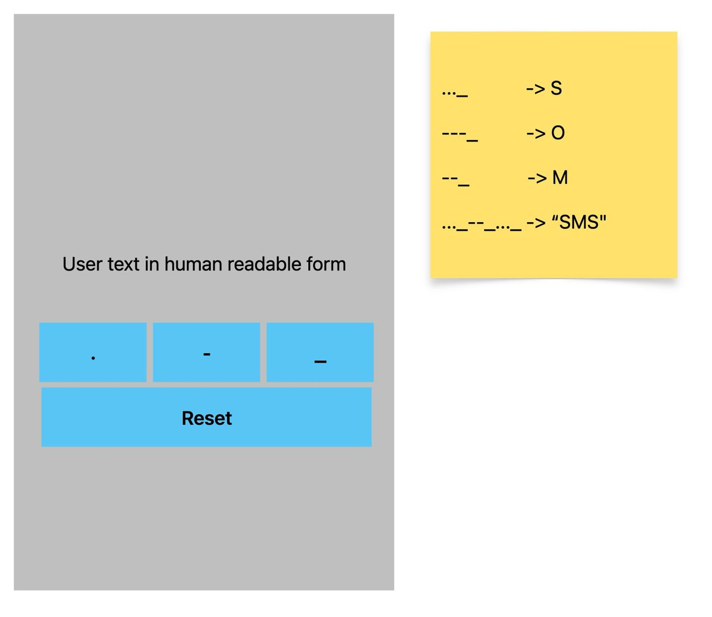

##  Лабораторна 1

* Потрібно створити додаток, що перетворює послідовність символів азбуки Морзе в англійську.
* Додаток має містити один екран, що містить лейбу з текстом, кнопки для кожного з символів та reset (див. прикріплений файл).
* При натиску на кнопку має створюватись подія натиску символу. 
* Послідовність символів азбуки Морзе перетворювати в символи англійського алфавіту як тільки ввід символа завершено (отримано паузу).
* Використовувати UIKit + RxSwift (без RxCocoa/RxRelay). 
* Використовувати MVVM архітектуру, винести логіку перетворення символів у VM. 
* У разі помилки показувати довільний Alert з повідомленням про помилку.
* Замість паузи (пробілу) використовувати нижнє підкреслення ("_").

